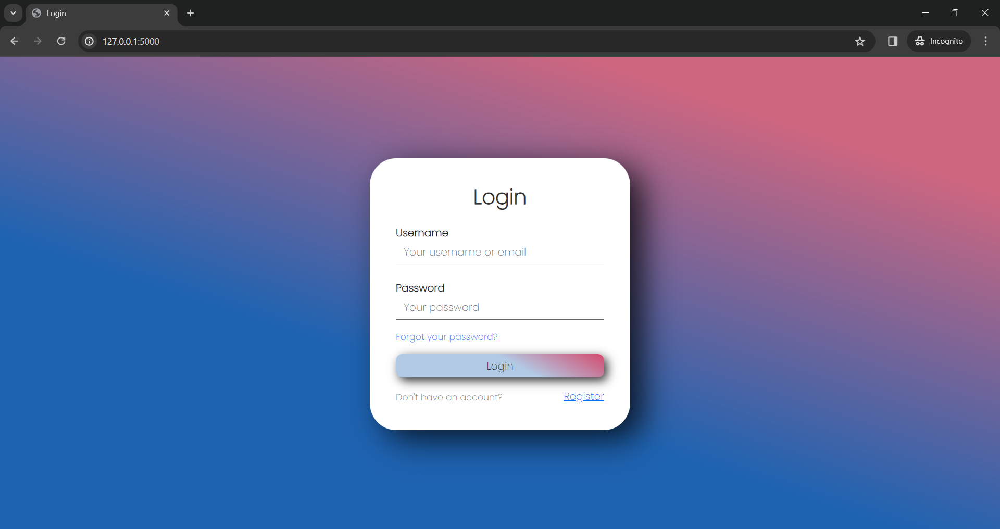
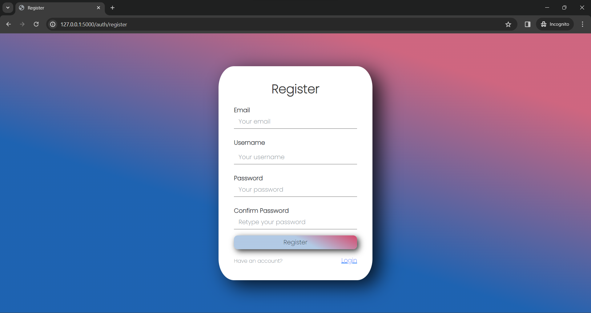
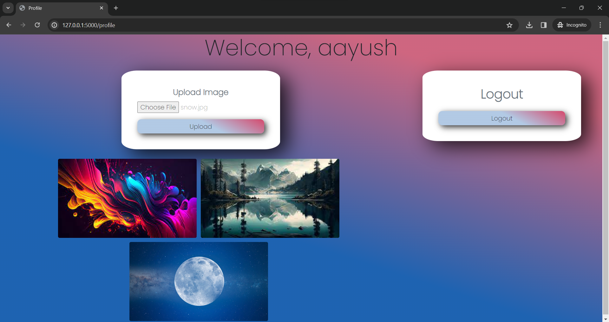

# Flask Login System with Authentication

## Introduction

This Flask web application serves as a comprehensive solution for implementing user authentication, offering functionalities for user registration, login, and logout. The goal is to provide a secure and organized structure for handling user interactions.

## Project Overview

### Project Structure

- **Blueprint Implementation:**
  - Utilized Flask blueprints to enhance code organization and maintainability.
  - Introduced separate blueprints for authentication (`auth`) and main routes (`main`).
  - Modularized the codebase for improved readability and scalability.

- **User Authentication:**
  - Implemented secure user registration and login functionalities.
  - Incorporated email verification through OTP (One-Time Password) for account activation.
  - Provided a password reset functionality with email-based token verification.

- **Database Integration:**
  - Connected the Flask application to a local SQL database using tools like SQLWorkbench or XAMPP SQL.
  - Utilized SQLAlchemy to integrate the database for storing user information securely.
  - Defined a `User` model to manage user data and relationships.

- **Environment Configuration:**
  - Utilized `python-dotenv` to load environment variables from a `.env` file.
  - Ensure to create a `.env` file in the project root and include necessary environment variables, such as database connection details.

- **Frontend Views:**
  - Created HTML templates for login, registration, and other user-related views.
  - Utilized Flask's rendering engine to seamlessly integrate Python logic with HTML.

### Git Repository Changes

Commits reflect the transition from a monolithic structure to using blueprints. Deleted unnecessary files and adapted the project structure for better clarity.

## Requirements

Ensure the following dependencies are installed before running the project:

- Python 3.x
- Flask
- Flask-Login
- SQLAlchemy
- python-dotenv

## Getting Started

Follow these steps to set up and run the project:

1. **Clone the Repository:**
    ```bash
    git clone https://github.com/aayushsoni4/Login-with-Authentication.git
    ```

2. **Navigate to the Project Directory:**
    ```bash
    cd Login-with-Authentication
    ```

3. **Create a Virtual Environment:**
    ```bash
    python -m venv venv
    ```

4. **Activate the Virtual Environment:**
    - On Windows:
        ```bash
        .\venv\Scripts\activate
        ```
    - On macOS and Linux:
        ```bash
        source .\venv\Scripts\activate
        ```

5. **Install Required Libraries:**
    ```bash
    pip install -r requirements.txt
    ```

6. **Environment Configuration:**
    - Create a `.env` file in the project root.
    - Include necessary environment variables, such as database connection details:
        ```plaintext
        DB_HOST=your_database_host
        DB_USER=your_database_user
        DB_PORT=your_database_port
        DB_PASSWORD=your_database_password
        DB_DATABASE=your_database_name
        YOUR_SECRET_KEY=your_flask_secret_key
        MAIL_SERVER=your_mail_server
        MAIL_PORT=your_mail_server_port
        MAIL_USERNAME=your_mail_username
        MAIL_PASSWORD=your_mail_password
        MAIL_DEFAULT_SENDER=your_default_sender_email_address
        otp_key=your_otp_key
        ```

7. **Database Setup:**
    - Connect the Flask app to your local SQL database using tools like SQLWorkbench or XAMPP SQL.
    - Update the database connection details in the `.env` file.

8. **Run the Flask App:**
    ```bash
    python run.py
    ```

## Usage

This project provides an excellent starting point for building Flask applications with robust user authentication. Developers can explore the codebase, leverage the implemented features, and customize it according to specific requirements.

## Video Demonstration


*Caption: Watch the video demonstration of our Flask application showcasing its features and functionalities.*

## Screenshots

### Login Page


*Caption: Screenshot of the login page where users can enter their credentials to log in.*

### Registration Page


*Caption: Screenshot of the registration page where users can create a new account.*

### Profile Page


*Caption: Screenshot of the profile page displaying user information and uploaded images.*

## Support and Feedback

Feel free to reach out if you have any questions or need further assistance. Contributions and suggestions are always welcome. Happy coding!
